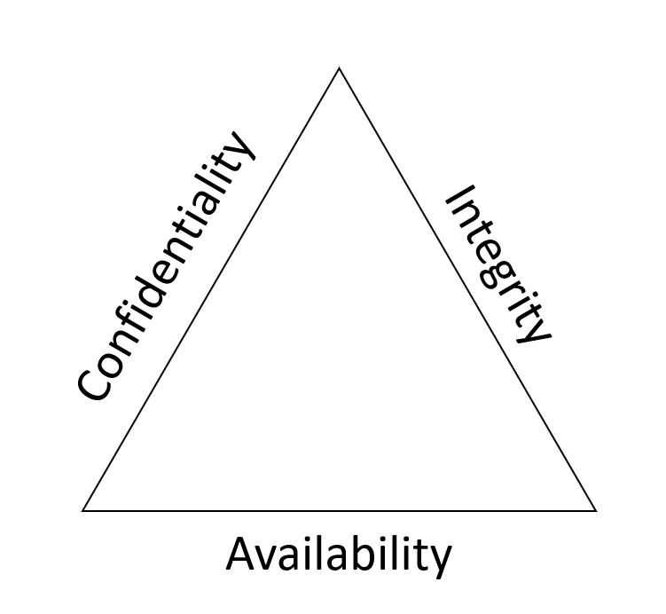

# Basic Cybersecurity

## Concepts Learned

### Concept of Cybersecurity

> `Confidentiality:` Information should only be visible to the right people.

> `Integrity:` Information should only be changed by the right people or processes.

> `Availability:` Information should be visible and accessible whenever needed.

### Threat Landscape

#### Examples of entry point for a cyberattack

> Email accounts

> Social media accounts

> Mobile devices

> The organization's technology infrastructure

> Cloud services

> People

#### Examples of attack vectors

> `Removable media.` An attacker can use media such as USB drives, smart cables, storage cards, and more to compromise a device. For example, attackers might load malicious code into USB devices that are subsequently provided to users as a free gift, or left in public spaces to be found. When they're plugged in, the damage is done.

> `Browser.` Attackers can use malicious websites or browser extensions to get users to download malicious software on their devices, or change a user's browser settings. The device can then become compromised, providing an entry point to the wider system or network.

> `Cloud services.` Organizations rely more and more on cloud services for day-to-day business and processes. Attackers can compromise poorly secured resources or services in the cloud. For example, an attacker could compromise an account in a cloud service, and gain control of any resources or services accessible to that account. They could also gain access to another account with even more permissions.

> `Insiders.` The employees of an organization can serve as an attack vector in a cyberattack, whether intentionally or not. An employee might become the victim of a cybercriminal who impersonates them as a person of authority to gain unauthorized access to a system. This is a form of social engineering attack. In this scenario, the employee serves as an unintentional attack vector. In some cases, however, an employee with authorized access may use it to intentionally steal or cause harm.

### Malware

#### Propagation Mechanism

> `Virus`: Most of us are already familiar with this term. But what does it actually mean? First, let’s think about viruses in nontechnical terms. In biology, for example, a virus enters the human body, and once inside, can spread and cause harm. Technology-based viruses depend on some means of entry, specifically a user action, to get into a system. For example, a user might download a file or plug in a USB device that contains the virus, and contaminates the system. You now have a security breach.

> `Worm`: In contrast to a virus, a worm doesn't need any user action to spread itself across systems. Instead, a worm causes damage by finding vulnerable systems it can exploit. Once inside, the worm can spread to other connected systems. For example, a worm might infect a device by exploiting a vulnerability in an application that runs on it. The worm can then spread across other devices in the same network and other connected networks.

> `Trojan`: A trojan horse attack gets its name from classical history, where soldiers hid inside a wooden horse that was presented as a gift to the Trojans. When the Trojans brought the wooden horse into their city, the soldiers emerged from hiding and attacked. In the context of cybersecurity, a trojan is a type of malware that pretends to be a genuine piece of software. When a user installs the program, it can pretend to be working as advertised, but the program also secretly performs malicious actions such as stealing information.

#### Payload

The payload is the action that a piece of malware performs on an infected device or system. Here are some common types of payload:

> `Ransomware` is a payload that locks systems or data until the victim has paid a ransom. Suppose there's an unidentified vulnerability in a network of connected devices. A cybercriminal can exploit this to access and then encrypt all files across this network. The attacker then demands a ransom in return for decrypting the files. They might threaten to remove all of the files if the ransom hasn't been paid by a set deadline.

> `Spyware` is a type of payload that spies on a device or system. For example, the malware may install keyboard scanning software on a user's device, collect password details, and transmit them back to the attacker, all without the user's knowledge.

> `Backdoors:` A backdoor is a payload that enables a cybercriminal to exploit a vulnerability in a system or device to bypass existing security measures and cause harm. Imagine that a cybercriminal infiltrates a software developing company and leaves some code that allows them to carry out attacks. This becomes a backdoor that the cybercriminal could use to hack into the application, the device it's running on, and even the organization's and customers' networks and systems.

> `Botnet` is a type of payload that joins a computer, server, or another device to a network of similarly infected devices that can be controlled remotely to carry out some nefarious action. A common application of botnet malware is crypto-mining (often referred to as crypto-mining malware). In this case, the malware connects a device to a botnet that consumes the device's computing power to mine or generate cryptocurrencies. A user might notice their computer is running slower than normal and getting worse by the day.

### Basic Mitigation Strategies

A mitigation strategy is a measure or collection of steps that an organization takes to prevent or defend against a cyberattack. This is usually done by implementing technological and organizational policies and processes designed to protect against attacks.

#### Multifactor authentication

Multifactor authentication works by requiring a user to provide multiple forms of identification to verify that they are who they claim to be. The most common form of identification used to verify or authenticate a user is a password. This represents something the user knows. Two other authentication methods provide something the user is, such as a fingerprint or retinal scan (a biometric form of authentication), or provide something the user has, such as a phone, hardware key, or other trusted device. Multifactor authentication employs two or more of these forms of proof to verify a valid user.

#### Browser security
    
- Prevent the installation of unauthorized browser extensions or add-ons.
- Only allow permitted browsers to be installed on devices.
- Block certain sites using web content filters.
- Keep browsers up to date.

#### Educate users

- Identify suspicious elements in a message.
- Never respond to external requests for personal information.
- Lock devices when they're not in use.
- Only store, share, and remove data according to the organization's policies.

