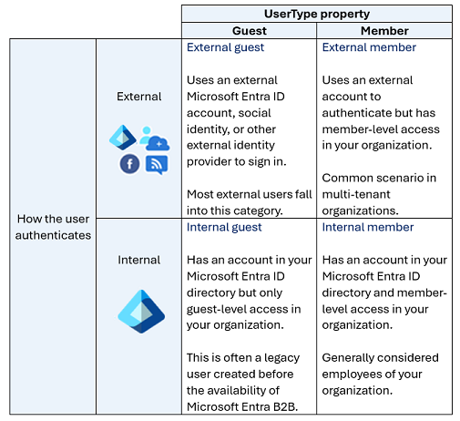

# Add title here

## Concepts Learned

### Basic terminology

- Tenant - A Microsoft Entra tenant is an instance of Microsoft Entra ID in which information about a single organization resides including organizational objects such as users, groups, devices, and application registrations. A tenant also contains access and compliance policies for resources, such as applications registered in the directory. Each Microsoft Entra tenant has a unique ID (tenant ID) and a domain name (for example, contoso.onmicrosoft.com) and serves as a security and administrative boundary, allowing the organization to manage and control access to resources, applications, devices, and services.

- Directory - The terms Microsoft Entra directory and Microsoft Entra tenant are often used interchangeably. The directory is a logical container within a Microsoft Entra tenant that holds and organizes the various resources and objects related to identity and access management including users, groups, applications, devices, and other directory objects. Basically, the directory is like a database or catalog of identities and resources associated with an organization's tenant. A Microsoft Entra tenant consists of only one directory.

- Multi-tenant - A multi-tenant organization is an organization that has more than one instance of Microsoft Entra ID. Reasons why an organization might have multiple tenants include organizations with multiple subsidiaries or business units that operate independently, organizations that merge or acquire companies, multiple geographical boundaries with various residency regulations, and more.

### Types of Identities

#### User

- Internal member: These users are typically considered employees of your organization. The user authenticates internally via their organization’s Microsoft Entra ID, and the user object created in the resource Microsoft Entra directory has a UserType of Member.

- External guest: External users or guests, including consultants, vendors, and partners, typically fall into this category. The user authenticates using an external Microsoft Entra account or an external identity provider (such as a social identity). The user object created in the resource Microsoft Entra directory has a UserType of Guest, giving them limited, guest-level permissions.

- External member: This scenario is common in organizations consisting of multiple tenants. Consider the scenario where the Contoso Microsoft Entra tenant and the Fabrikam Microsoft Entra tenant are tenants within one large organization. Users from the Contoso tenant need member level access to resources in Fabrikam. In this scenario, Contoso users are configured in the Fabrikam Microsoft Entra directory such that they authenticate with their Contoso account, which is external to Fabrikam, but have a UserType of Member to enable member-level access to Fabrikam’s organizational resources.

- Internal guest: This scenario exists when organizations who collaborate with distributors, suppliers, and vendors set up internal Microsoft Entra accounts for these users but designate them as guests by setting the user object UserType to Guest. As a guest, they have reduced permissions in the directory. This is considered a legacy scenario as it is now more common to use B2B collaboration. With B2B collaboration users can use their own credentials, allowing their external identity provider to manage authentication and their account lifecycle.

#### Device
A device is a piece of hardware, such as mobile devices, laptops, servers, or printers. A device identity gives administrators information they can use when making access or configuration decisions. Device identities can be set up in different ways in Microsoft Entra ID.

- Microsoft Entra registered devices. The goal of Microsoft Entra registered devices is to provide users with support for bring your own device (BYOD) or mobile device scenarios. In these scenarios, a user can access your organization’s resources using a personal device. Microsoft Entra registered devices register to Microsoft Entra ID without requiring an organizational account to sign in to the device.

- Microsoft Entra joined. A Microsoft Entra joined device is a device joined to Microsoft Entra ID through an organizational account, which is then used to sign in to the device. Microsoft Entra joined devices are generally owned by the organization.

- Microsoft Entra hybrid joined devices. Organizations with existing on-premises Active Directory implementations can benefit from the functionality provided by Microsoft Entra ID by implementing Microsoft Entra hybrid joined devices. These devices are joined to your on-premises Active Directory and Microsoft Entra ID requiring organizational account to sign in to the device.

#### Managed identities

Managed identities are a type of service principal that are automatically managed in Microsoft Entra ID and eliminate the need for developers to manage credentials. Managed identities provide an identity for applications to use when connecting to Azure resources that support Microsoft Entra authentication and can be used without any extra cost.

- System-assigned. Some Azure resources, such as virtual machines, allow you to enable a managed identity directly on the resource. When you enable a system-assigned managed identity an identity is created in Microsoft Entra that's tied to the lifecycle of that Azure resource. Because the identity is tied to the lifecycle of that Azure resource when the resource is deleted, Azure automatically deletes the identity for you. An example where you may find a system-assigned identity is when a workload is contained within a single Azure resource, such as an application that runs on a single virtual machine.

- User-assigned. You may also create a managed identity as a standalone Azure resource. Once you create a user-assigned managed identity, you can assign it to one or more instances of an Azure service. For example, a user-assigned managed identity can be assigned to multiple VMs. With user-assigned managed identities, the identity is managed separately from the resources that use it. Deleting the resources that use the user-assigned managed identity doesn't delete the identity. The user-assigned managed identity must be explicitly deleted. This is useful in a scenario where you may have multiple VMs that all have the same set of permissions but may get recycled frequently. Deleting any of the VMs doesn’t impact the user-assigned managed identity. Similarly, you can create a new VM and assign it the existing user-assigned managed identity.