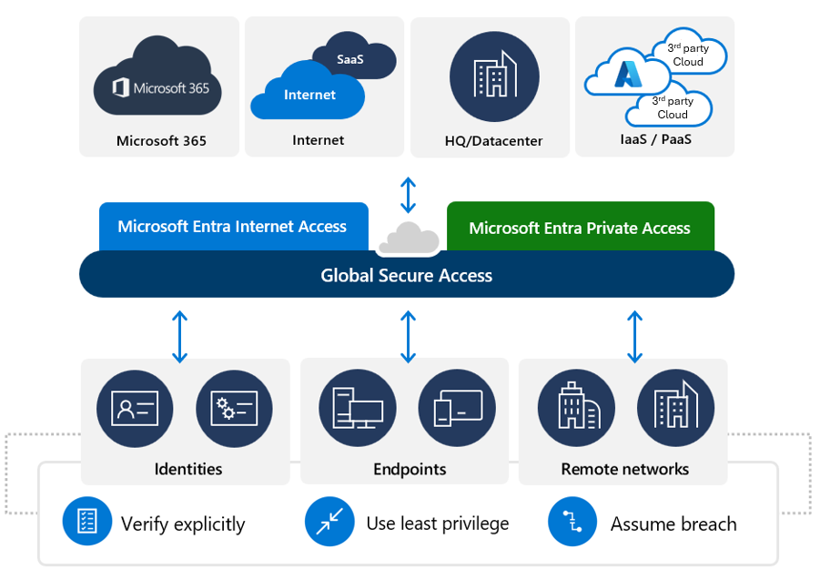

# Access Management Capabilities of Microsoft Entra

## Concepts Learned

### Conditional Access

#### Assignments
When creating a conditional access policy, admins can determine which signals to use through assignments. The assignments portion of the policy controls the who, what, where, and when of the Conditional Access policy. All assignments are logically ANDed. If you have more than one assignment configured, all assignments must be satisfied to trigger a policy. Some of the assignments include:

- Users assign who the policy will include or exclude. This assignment can include all users in the directory, specific users and groups, directory roles, external guests, and workload identities.
- Target resources include applications or services, user actions, Global Secure Access (preview), or authentication context.
    - Cloud apps - Administrators can choose from the list of applications or services that include built-in Microsoft applications, including Microsoft Cloud applications, Office 365, the Windows Azure Service Management API, Microsoft Admin portals, and any Microsoft Entra registered applications.
    - User actions - Administrators can choose to define policy not based on a cloud application but on a user action like Register security information or Register or join devices, allowing Conditional Access to enforce controls around those actions.
    - Global Secure Access (preview) - Administrators can use conditional Access policies to secure the traffic that passes through the Global Secure Access service. This is done by defining traffic profiles in Global Secure Access. Conditional Access policies can then be assigned to the Global Secure Access traffic profile.
    - Authentication context - Authentication context can be used to further secure data and actions in applications. For example, users that have access to specific content in a SharePoint site may be required to access that content via a managed device or agree to specific terms of use.
- Network allows you to control user access based on the user's network or physical location. You can include any network or location, locations marked as trusted networks or trusted IP address ranges, or named locations. You can also identify compliant networks that are made up of users and devices that comply with your organization's security policies.
- Conditions define where and when the policy will apply. Multiple conditions can be combined to create fine-grained and specific Conditional Access policies. Some of the conditions include:
    - Sign-in risk and user risk. Integration with Microsoft Entra ID Protection allows Conditional Access policies to identify suspicious actions related to user accounts in the directory and trigger a policy. Sign-in risk is the probability that a given sign-in, or authentication request, isn't authorized by the identity owner. User risk is the probability that a given identity or account is compromised.
    - Insider risk. Administrators with access to Microsoft Purview adaptive protection can incorporate risk signals from Microsoft Purview into Conditional Access policy decisions. Insider risk takes into account your data governance, data security, and risk and compliance configurations from Microsoft Purview.
    - Devices platform. Device platform, which is characterized by the operating system that runs on a device can be used when enforcing Conditional Access policies.
    - Client apps. Client apps, the software the user is employing to access the cloud app, including browsers, mobile apps, desktop clients, can also be used in access policy decision.
    - Filters for devices. Organizations can enforce policies based on device properties, by using the filters for devices option. As an example, this option may be used to target policies to specific devices like privileged access workstations.

#### Access controls
When the Conditional Access policy has been applied, an informed decision is reached on whether to block access, grant access, grant access with extra verification, or apply a session control to enable a limited experience. The decision is referred to as the access controls portion of the Conditional Access policy and defines how a policy is enforced. Common decisions are:

- Block access
- Grant access. Administrators can grant access without any additional control, or they can choose to enforce one or more controls when granting access. Examples of controls used to grant access include requiring users to perform multifactor authentication, requiring specific authentication methods to access a resource, requiring devices to meet specific compliance policy requirements, require a password change, and more. For a complete list, refer to Grant controls in Conditional Access policy.
- Session. Within a Conditional Access policy, an administrator can make use of session controls to enable limited experiences within specific cloud applications. As an example, Conditional Access App Control uses signals from Microsoft Defender for Cloud Apps to block the download, cut, copy, and print capabilities for sensitive documents, or to require labeling of sensitive files. Other session controls include sign-in frequency and application enforced restrictions that, for selected applications, use the device information to provide users with a limited or full experience, depending on the device state. For a complete list, refer Session controls in Conditional Access policy.

### Global Secure Access in Microsoft Entra

Microsoft Entra provides a set of products under the heading of Microsoft Global Secure Access. Global Secure Access is the unifying term used for both Microsoft Entra Internet Access and Microsoft Entra Private Access.

Microsoft Entra Internet Access secures access to Software as a Service (SaaS) applications, including Microsoft Services, and public internet apps while protecting users, devices, and data against internet threats.

Microsoft Entra Private Access provides your users, whether in an office or working remotely, secure access to your private, corporate resources.

Microsoft Entra Internet Access and Microsoft Entra Private Access come together as a solution that converges Zero Trust network, identity, and endpoint access controls so that you can secure access to any app or resource, from any location, device, or identity. This type of solution represents a new network security category called Security Service Edge (SSE).

SSE helps address security challenges such as:

- The need to reducing the risk of lateral movement through a compromised VPN tunnel.
- The need to put a perimeter around internet-based assets.
- The need to improve service in remote office locations, such branch offices.

#### Microsoft Entra Private Access

Conceptually, the way Private Access works is that for a given set of private resources you want to secure, you set up a new enterprise application that serves as a container for those private resources. The new application has a network connector that serves as a broker between the Private Access service and the resource a user wants to access. Now clearly, enterprises have different requirements for accessing different private resources, so Microsoft Entra Private Access provides two ways in which you can set up the private resources you want to have accessed through the service.

- Quick Access - As previously described, Private Access works by creating a new enterprise application that serves as a container for the private resources you want to secure. With Quick Access, you determine which private resources to add to the "container" or enterprise application; which, we'll call the Quick Access application. The private resources you add to the Quick Access Application are defined by the FQDN, IP address, IP or address range, and ports used to access the resource. This information is referred to as a Quick Access application segment. You can add many application segments to the Quick Access application. You can then link conditional access policies to the Quick Access application.

- Global Secure Access app - Global Secure Access app, also referred to as Per-app Access, provides a more granular approach. With Global Secure Access app, you can create multiple "containers" or enterprise application. For each of these new enterprise apps, you define the properties of the private resource, and you assign users and groups and assign specific conditional access policies. For example, you may have a group of private resources you need to secure, but for which you want to set different access policies based on how they're accessing the resource or for a specific time frame.

#### Microsoft Entra Internet Access
A Secure Web Gateway (SWG) is a cybersecurity solution that protects users from web-based threats by filtering internet traffic and enforcing security policies.

Microsoft Entra Internet Access provides an identity-centric Secure Web Gateway (SWG) solution for Software as a Service (SaaS) applications, including Microsoft Services, and other Internet traffic. It protects users, devices, and data from the Internet's wide threat landscape with best-in-class security controls and visibility through Traffic Logs.

Some of the key features include:

- Protection against user identity or token theft by using Conditional Access policies to perform a compliant network check for access to resources.
    - Compliant network enforcement happens at authentication plane and at the data plane. Authentication plane enforcement is performed by Microsoft Entra ID at the time of user authentication. Data plane enforcement works with services that support Continuous Access Evaluation (CAE)
    - Continuous Access Evaluation (CAE) is a security feature where apps and Microsoft Entra constantly communicate to ensure user access is up-to-date and secure. If something changes, like a user’s location or a security concern arises, the system can quickly adjust or block access in near real-time, ensuring policies are always enforced.
- Tenant restrictions to prevent data exfiltration to other tenants or personal accounts including anonymous access.
- Internet Access traffic forwarding profile policies to control which internet sites can be accessed to ensure remote workers connect to the internet in a controlled and secure way.
- Web content filtering to regulate access to websites based on their content categories and domain names.

#### Global Secure Access Dashboard
Global Secure Access includes a dashboard that provides you with visualizations of the network traffic acquired by the Microsoft Entra Private and Microsoft Entra Internet Access services. The dashboard compiles the data from your network configurations, including devices, users, and tenants into several widgets. Those widgets, in turn, provide you with information you can use to monitor and improve your network configurations. Some of the available widgets include:

- Global Secure Access snapshot
- Alerts and notifications (preview)
- Usage profiling (preview)
- Cross-tenant access
- Web category filtering
- Device status

##### Global Secure Access snapshot

The Global Secure Access snapshot widget provides a summary of how many users and devices are using the service and how many applications were secured through the service. The widget defaults to showing all types of traffic, but you can change the filter to show Internet Access, Private Access, or Microsoft traffic.

##### Usage profiling (preview)

The Usage profiling widget displays usage patterns for Internet Access, Private Access, or Microsoft 365 over a selected period of time and by category.

##### Alerts and notifications (preview)

The Alerts and notifications widget shows what is happening in the network and helps identify suspicious activities or trends identified by the network data.

This widget provides the following alerts:

- Unhealthy remote network: An unhealthy remote network has one or more device links disconnected.
- Increased external tenants activity: The number of users accessing external tenants has increased.
- Token and device inconsistency: The original token is used on a different device.
- Web content blocked: Access to the website has been blocked.

##### Cross-tenant access 

Global Secure Access provides visibility into the number of users and devices that are accessing other tenants. This widget displays the following information:

- Sign-ins: The number of sign-ins through Microsoft Entra ID to Microsoft services in the last 24 hours. This widget provides you with information about the activity in your tenant.
- Total distinct tenants: The number of distinct tenant IDs seen in the last 24 hours.
- Unseen tenants: The number of distinct tenant IDs that were seen in the last 24 hours, but not in the previous seven days.
- Users: The number of distinct user sign-ins to other tenants in the last 24 hours.
- Devices: The number of distinct devices that signed in to other tenants in the last 24 hours.

##### Web category filtering

The Web category filtering widget displays the top categories of web content that were blocked or allowed by the service. These categories can be used to determine what sites or categories of sites you might want to block.

##### Device status 

The Device status widgets display the active and inactive devices that you have deployed.

### Microsoft Entra Roles and Role-Based Access Control (RBAC)

#### Built-in roles
Microsoft Entra ID includes many built-in roles, which are roles with a fixed set of permissions. A few of the most common built-in roles are:

- Global administrator: users with this role have access to all administrative features in Microsoft Entra. The person who signs up for the Microsoft Entra tenant automatically becomes a global administrator.
- User administrator: users with this role can create and manage all aspects of users and groups. This role also includes the ability to manage support tickets and monitor service health.
- Billing administrator: users with this role make purchases, manage subscriptions and support tickets, and monitor service health.

#### Custom roles
Although there are many built-in admin roles in Microsoft Entra, custom roles give flexibility when granting access. A custom role definition is a collection of permissions that you choose from a preset list. The list of permissions to choose from are the same permissions used by the built-in roles. The difference is that you get to choose which permissions you want to include in a custom role.

#### Categories of Microsoft Entra roles

To make it convenient to manage identity across Microsoft 365 services, Microsoft Entra ID has added some service-specific, built-in roles, each of which grants administrative access to a Microsoft 365 service. This means that Microsoft Entra built-in roles differ in where they can be used. There are three broad categories.

- Microsoft Entra specific roles: These roles grant permissions to manage resources within Microsoft Entra-only. For example, User Administrator, Application Administrator, Groups Administrator all grant permissions to manage resources that live in Microsoft Entra ID.
- Service-specific roles: For major Microsoft 365 services, Microsoft Entra ID includes built-in, service-specific roles that grant permissions to manage features within the service. For example, Microsoft Entra ID includes built-in roles for Exchange Administrator, Intune Administrator, SharePoint Administrator, and Teams Administrator roles that can manage features with their respective services.
- Cross-service roles: There are some roles within Microsoft Entra ID that span services. For example, Microsoft Entra ID has security-related roles, like Security Administrator, that grant access across multiple security services within Microsoft 365. Similarly, the Compliance Administrator role grants access to manage Compliance-related settings in Microsoft 365 Compliance Center, Exchange, and so on.

#### Difference between Microsoft Entra RBAC and Azure RBAC
As described above, Microsoft Entra built-in and custom roles are a form of RBAC in that they control access to Microsoft Entra resources. This is referred to as Microsoft Entra RBAC. In the same way that Microsoft Entra roles can control access to Microsoft Entra resources, so too can Azure roles control access to Azure resources. This is referred to as Azure RBAC. Although the concept of RBAC applies to both Microsoft Entra RBAC and Azure RBAC, what they control are different.

- Microsoft Entra RBAC - Microsoft Entra roles control access to Microsoft Entra resources such as users, groups, and applications.
- Azure RBAC - Azure roles control access to Azure resources such as virtual machines or storage using Azure Resource Management.