# Identity Protection and Governance Capabilities of Microsoft Entra

## Concepts Learned

### Microsoft Entra ID Governance

ID Governance gives organizations the ability to do the following tasks:

- Govern the identity lifecycle.
- Govern access lifecycle.
- Secure privileged access for administration.
- These actions can be completed for employees, business partners and vendors, and across services and applications, both on-premises and in the cloud.

It's intended to help organizations address these four key questions:

- Which users should have access to which resources?
- What are those users doing with that access?
- Are there effective organizational controls for managing access?
- Can auditors verify that the controls are working?

#### Identity lifecycle

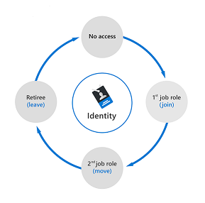

In Microsoft Entra ID Governance, you can automate the identity lifecycle of users using:

- Inbound provisioning from your organization's HR sources, to automatically maintain user identities in both Microsoft Entra ID and Active Directory.
- Lifecycle workflows to automate workflow tasks that run at certain key events, such before a new employee is scheduled to start work at the organization, as they change status during their time in the organization, and as they leave the organization.
- Automatic assignment policies in entitlement management to add and remove a user's group memberships, application roles, and SharePoint site roles, based on changes to the user's attributes. Information on entitlement management is covered in a subsequent unit.
- User provisioning to create, update, and remove user accounts in other applications, with connectors to hundreds of cloud and on-premises applications.

#### Privileged access lifecycle
Monitoring privileged access is a key part of identity governance. When employees, vendors, and contractors are assigned administrative rights, there should be a governance process because of the potential for misuse.

Microsoft Entra Privileged Identity Management (PIM) provides extra controls tailored to securing access rights. PIM helps you minimize the number of people who have access to resources across Microsoft Entra ID, Azure, and other Microsoft online services. PIM provides a comprehensive set of governance controls to help secure your company's resources.

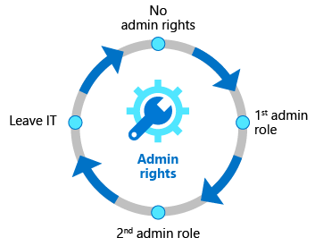

### Access Reviews

Microsoft Entra access reviews enable organizations to efficiently manage group memberships, access to enterprise applications, and role assignment. Regular access reviews ensure that only the right people have access to resources. Excessive access rights are a known security risk. However, when people move between teams, or take on or relinquish responsibilities, access rights can be difficult to control.

Microsoft Entra ID enables you to collaborate with users from inside your organization and with external users. Users can join groups, invite guests, connect to cloud apps, and work remotely from their work or personal devices. This convenience has led to a need for better access management capabilities.

Examples of use cases for access reviews.

- Too many users in privileged roles: It's a good idea to check how many users have administrative access and if there are any invited guests or partners that haven't been removed after being assigned to do an administrative task. You can recertify the role assignment of users in Microsoft Entra roles such as Global Administrators, or Azure resources roles such as User Access Administrator in the Microsoft Entra Privileged Identity Management (PIM) experience.
- Business critical data access: For certain resources, such as business critical applications, it might be required as part of compliance processes to ask people to regularly reconfirm and give a justification on why they need continued access.
- To maintain a policy's exception list: Sometimes there are business cases that require you to make exceptions to policies. As the IT admin, you can manage this task and provide auditors with proof that these exceptions are reviewed regularly.
- Ask group owners to confirm they still need guests in their groups: If a group gives guests access to business sensitive content, then it's the group owner's responsibility to confirm the guests still have a legitimate business need for access.
- Have reviews recur periodically: You can set up recurring access reviews of users at set frequencies such as weekly, monthly, quarterly or annually. Reviewers are notified at the start of each review and upon completion approve or deny access through a friendly user interface and with the help of smart recommendations.

#### Manage user and guest user access with access reviews
With access reviews, you can easily ensure that users or guests have appropriate access. You can ask the users themselves or a decision maker to participate in an access review and recertify (or attest) to users' access. The reviewers can give their input on each user's need for continued access based on suggestions from Microsoft Entra ID. When an access review is finished, you can then make changes and remove access from users who no longer need it.

#### Multi-stage access reviews
Multi-stage access reviews allow you and your organization to enable complex workflows to meet recertification and audit requirements calling for multiple reviewers to attest to access for users in a particular sequence. It also helps you design more efficient reviews for your resource owners and auditors by reducing the number of decisions each reviewer is accountable for.

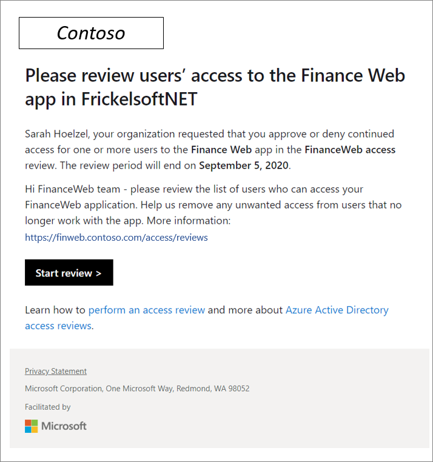

### Entitlement Management

Entitlement management is an identity governance feature that enables organizations to manage the identity and access lifecycle at scale. Entitlement management automates access request workflows, access assignments, reviews, and expiration.

- Users may not know what access they should have, and even if they do, they might have difficulty locating the right individuals to approve it.
- When users find and receive access to a resource, they may hold on to access longer than is required for business purposes.
- Managing access for external users.

Entitlement management includes the following capabilities to address these challenges:

- Delegate the creation of access packages to non-administrators. These access packages contain resources that users can request. The delegated access package managers then define policies that include rules such as which users can request access, who must approve their access, and when access expires.
- Managing external users. When a user who isn't yet in your directory requests access, and is approved, they're automatically invited into your directory and assigned access. When their access expires, if they have no other access package assignments, their B2B account in your directory can be automatically removed.
- Entitlement management uses access packages to manage access to resources.

#### Microsoft Entra terms of use
Microsoft Entra terms of use allow information to be presented to users, before they access data or an application. Terms of use ensure users read relevant disclaimers for legal or compliance requirements.

Example use cases where employees or guests may be required to accept terms of use include:

- Before they access sensitive data or an application.
- On a recurring schedule, so they're reminded of regulations.
- Based on user attributes, such as terms applicable to certain roles.
- Presenting terms for all users in your organization.

### Capabilities of Privileged Identity Management (PIM)

PIM is:

- Just in time, providing privileged access only when needed, and not before.
- Time-bound, by assigning start and end dates that indicate when a user can access resources.
- Approval-based, requiring specific approval to activate privileges.
- Visible, sending notifications when privileged roles are activated.
- Auditable, allowing a full access history to be downloaded.

PIM also provides oversight for what users are doing with their administrator privileges.

Today, you can use PIM with:

- Microsoft Entra roles – Sometimes referred to as directory roles, Microsoft Entra roles include built-in and custom roles to manage Microsoft Entra ID and other Microsoft 365 online services.

- Azure roles – The role-based access control (RBAC) roles in Azure that grants access to management groups, subscriptions, resource groups, and resources.

- PIM for Groups – Provide just-in-time membership in the group and just-in-time ownership of the group. The Microsoft Entra Privileged Identity Management for Groups feature can be used to govern access to various scenarios that include Microsoft Entra roles, Azure roles, as well as Azure SQL, Azure Key Vault, Intune, other application roles, and third party applications.

#### General workflow
There are a few steps that are generally part of a basic workflow when deploying PIM. These steps are: assign, activate, approve/deny, and extend/renew.

- Assign - The assignment process starts by assigning roles to members. To grant access to a resource, the administrator assigns roles to users, groups, service principals, or managed identities. The assignment includes the following data:

    - Members or owners - The members or owners to assign to the role.
    - Scope - The scope limits the assigned role to a particular set of resources.
    - Assignment type - There are two options. Eligible assignments require the member of the role to perform an action to use the role. Actions might include activation, or requesting approval from designated approvers. Active assignments don't require the member to perform any action to use the role. Members assigned as active have the privileges assigned to the role.
    - Duration - The duration of the assignment is defined by start and end dates or is set to permanent.

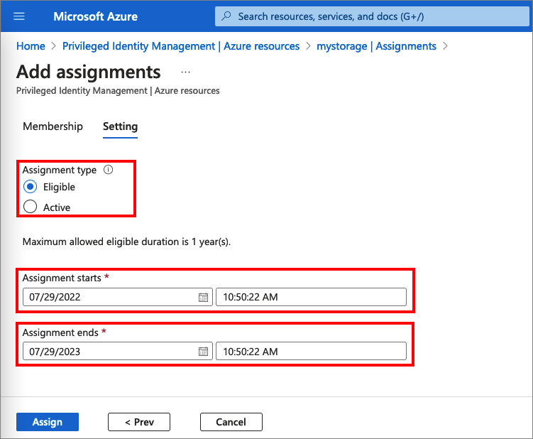

- Activate - If users have been made eligible for a role, then they must activate the role assignment before using the role. To activate the role, users select specific activation duration within the maximum (configured by administrators), and the reason for the activation request.

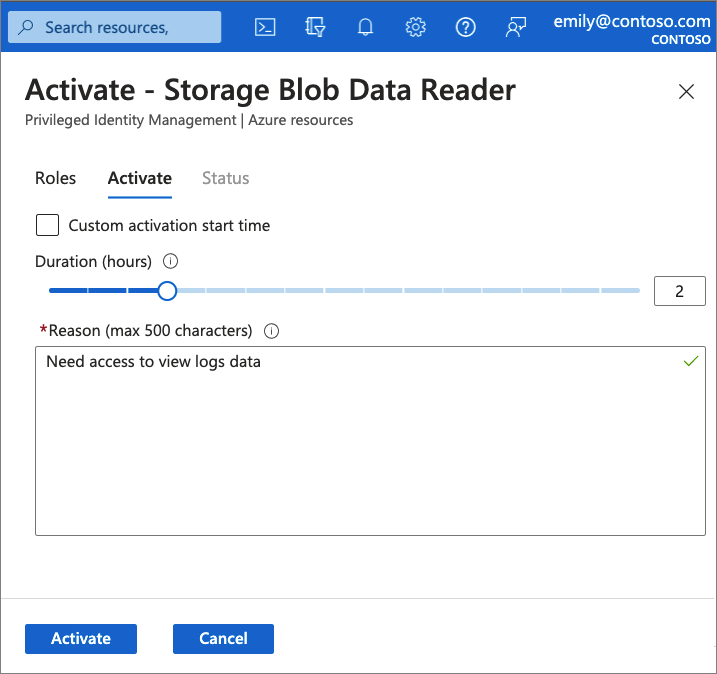

- Approve or deny - Delegated approvers receive email notifications when a role request is pending their approval. Approvers can view, approve or deny these pending requests in PIM. After the request has been approved, the member can start using the role.

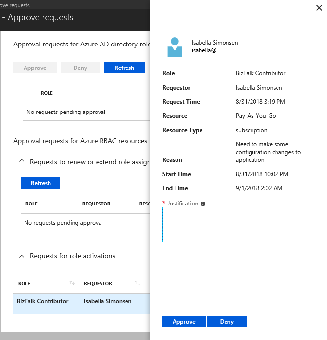

- Extend and renew - When a role assignment nears expiration, the user can use PIM to request an extension for the role assignment. When a role assignment has already expired, the user can use Privileged Identity Management to request a renewal for the role assignment.

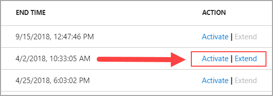

#### Audit
You can use the Privileged Identity Management (PIM) audit history to see all role assignments and activations within the past 30 days for all privileged roles.

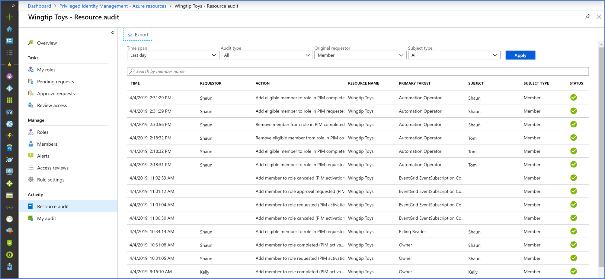

### Microsoft Entra ID Protection

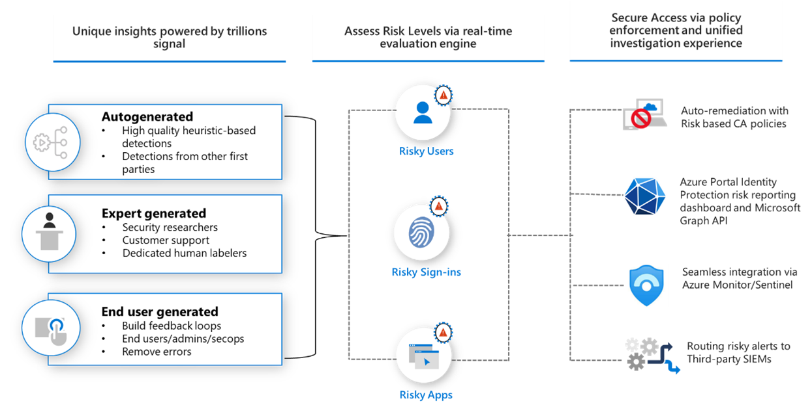

#### Detect risks
Microsoft analyses trillions of signals per day to identify potential threats. These signals come from learnings Microsoft has acquired from numerous sources, including Microsoft Entra ID, the consumer space with Microsoft Accounts, and in gaming with Xbox.

Microsoft Entra ID Protection provides organizations with information of suspicious activity in their tenant and allows them to respond quickly to prevent further risk occurring. Risk detections can include any suspicious or anomalous activity related to a user account in the directory. ID Protection risk detections can be linked to a sign-in event (sign-in risk) or an individual user (user risk).

- Sign-in risk. A sign-in represents the probability that a given authentication request isn't authorized by the identity owner. Examples include a sign-in from an anonymous IP address, atypical travel (two sign-ins originating from geographically distant locations), unfamiliar sign-in properties, and more.
- User risk. A user risk represents the probability that a given identity or account is compromised. Examples include leaked credentials, user reported suspicious activity, suspicious sending patterns, and more.

#### Investigate risks
Any risks detected on an identity are tracked with reporting. Identity Protection provides three key reports for administrators to investigate risks and take action:

- Risk detections: Each risk detected is reported as a risk detection.
- Risky sign-ins: A risky sign-in is reported when there are one or more risk detections reported for that sign-in.
- Risky users: A Risky user is reported when either or both of the following are true:
    - The user has one or more Risky sign-ins.
    - One or more risk detections are reported.
    
    For businesses that are onboarded to Microsoft Copilot for Security The risky users' report, embeds the capabilities of Microsoft Copilot for Security to summarize a user's risk level, provide insights relevant to the incident at hand, and provide recommendations for rapid mitigation.

Investigation of events is key to understanding and identifying any weak points in your security strategy.

#### Remediate
After completing an investigation, admins will want to take action to remediate the risk or unblock users. Organizations can enable automated remediation using their risk policies. For example, risk-based conditional access policies can be enabled to require access controls such as providing a strong authentication method, perform multifactor authentication, or perform a secure password reset based on the detected risk level. If the user successfully completes the access control, the risk is automatically remediated.

When automated remediation isn't enabled, an administrator must manually review the identified risks in the reports through the portal, through the API, or in Microsoft Defender XDR. Administrators can perform manual actions to dismiss, confirm safe, or confirm compromise on the risks.

#### Export
Data from Identity Protection can be exported to other tools for archive, further investigation, and correlation. The Microsoft Graph based APIs allow organizations to collect this data for further processing in tools such as a SIEM. The data can also be sent to a Log Analytics workspace, archived data to a storage account, streamed to Event Hubs, or solutions.

### Microsoft Entra Permissions Management

Organizations need to consider permissions management as a central piece of their Zero Trust security strategy that includes implementing least privilege access across their entire infrastructure. Some of the key reasons include:

- Organizations are increasingly adopting multicloud strategy and are struggling with the lack of visibility and the increasing complexity of managing access permissions.
- With the proliferation of identities and cloud services, the number of high-risk cloud permissions is exploding, expanding the attack surface for organizations.
- IT security teams are under increased pressure to ensure access to their expanding cloud estate is secure and compliant.
- The inconsistency of cloud providers' native access management models makes it even more complex for Security and Identity to manage permissions and enforce least privilege access policies across their entire environment.

#### Discover
Customers can assess permission risks by evaluating the gap between permissions granted and permissions used.

- Cross-cloud permissions discovery: Granular and normalized metrics for key cloud platforms: AWS, Azure, and GCP.

- Permission Creep Index (PCI): An aggregated metric that periodically evaluates the level of risk associated with the number of unused or excessive permissions across your identities and resources. It measures how much damage identities can cause based on the permissions they have.

- Permission usage analytics: Multi-dimensional view of permissions risk for all identities, actions, and resources.

#### Remediate
Customers can right-size permissions based on usage, grant new permissions on-demand, and automate just-in-time access for cloud resources.

- Automated deletion of permissions unused for the past 90 days.
- Permissions on-demand: Grant identities permissions on-demand for a time-limited period or an as-needed basis.

#### Monitor

Customers can detect anomalous activities with machine learning-powered (ML-powered) alerts and generate detailed forensic reports.

ML-powered anomaly detections. Context-rich forensic reports around identities, actions, and resources to support rapid investigation and remediation. Permissions Management deepens Zero Trust security strategies by augmenting the least privilege access principle, allowing customers to:

- Get comprehensive visibility: Discover which identity is doing what, where, and when.
- Automate least privilege access: Use access analytics to ensure identities have the right permissions, at the right time.
- Unify access policies across infrastructure as a service (IaaS) platforms: Implement consistent security policies across your cloud infrastructure.
Once your organization has explored and implemented the discover, remediation and monitor phases, you've established one of the core pillars of a modern zero-trust security strategy.

### Microsoft Entra Verified ID

This diagram illustrates the participation of three parties in a verifiable credential’s interaction. This solution automates verification of identity credentials and claims.

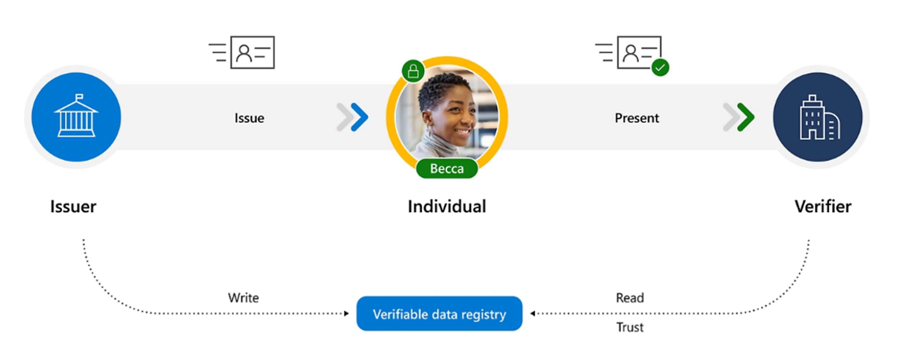

- The issuer is an organization that attests to claims and grants digitally signed credentials to the user. An issuer can be an identity verification provider, a government agency, an employer, a university, or any other organization that can provide proof of the user’s credential.
- The user receives and approves the credentials obtained from the issuer, stores and manages credentials in their digital wallet, and presents it to the verifier. The credential claims are cryptographically signed with the user’s private key.
- The verifier is an organization that requests proof and, upon receipt, verifies that the claims in the credentials satisfy requirements. A verifier could be a prospective employer, and airline, mortgage company, or any organization that is requesting proof of the user’s credential.

### Microsoft Entra integration with Microsoft Copilot for Security

Microsoft Entra capabilities in Copilot are built-in prompts that you can use but you can also enter your own prompts based on the capabilities supported.

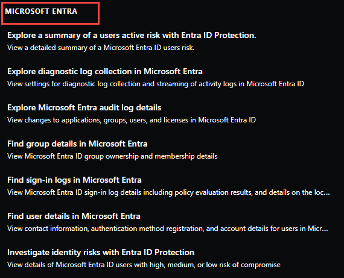