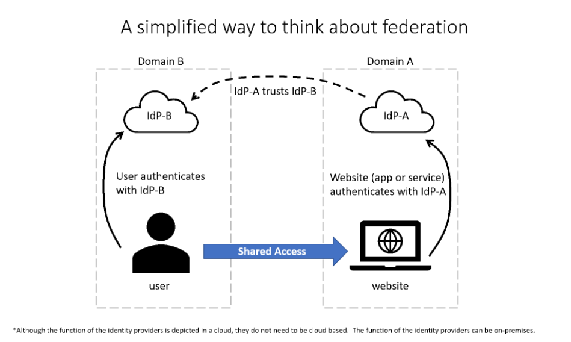

# Define authentication and authorization

## Concepts Learned

### Authentication and Authorization

#### Authentication
Authentication is the process of proving that a person is who they say they are. When someone purchases an item with a credit card, they may be required to show an additional form of identification. This proves that they are the person whose name appears on the card. In this example, the user may show a driver’s license that serves as a form of authentication and proves their ID.

When you want to access a computer or device, you'll encounter a similar type of authentication. You may get asked to enter a username and password. The username states who you are, but by itself isn't enough to grant you access. When combined with the password, which only that user should know, it allows access to your systems. The username and password, together, are a form of authentication. Authentication is sometimes shortened to AuthN.

#### Authorization
Once you authenticate a user, you'll need to decide where they can go, and what they're allowed to see and touch. This process is called authorization.

Suppose you want to spend the night in a hotel. The first thing you'll do is go to reception to start the "authentication process". After the receptionist has verified who you are, you're given a keycard and can go to your room. Think of the keycard as the authorization process. The keycard will only let you open the doors and elevators you're permitted to access, such as for your hotel room.

In cybersecurity terms, authorization determines the level of access or the permissions an authenticated person has to your data and resources. Authorization is sometimes shortened to AuthZ.

### Identity as the Primary Security Perimeter

#### Four pillars of an identity infrastructure

> `Administration.` Administration is about the creation and management/governance of identities for users, devices, and services. As an administrator, you manage how and under what circumstances the characteristics of identities can change (be created, updated, deleted).

> `Authentication.` The authentication pillar tells the story of how much an IT system needs to know about an identity to have sufficient proof that they really are who they say they are. It involves the act of challenging a party for legitimate credentials.

> `Authorization.` The authorization pillar is about processing the incoming identity data to determine the level of access an authenticated person or service has within the application or service that it wants to access.

> `Auditing.` The auditing pillar is about tracking who does what, when, where, and how. Auditing includes having in-depth reporting, alerts, and governance of identities.

### Directory Services and Active Directory

In the context of a computer network, a directory is a hierarchical structure that stores information about objects on the network. A directory service stores directory data and makes it available to network users, administrators, services, and applications.

Active Directory (AD) is a set of directory services developed by Microsoft as part of Windows 2000 for on-premises domain-based networks. The best-known service of this kind is Active Directory Domain Services (AD DS). It stores information about members of the domain, including devices and users, verifies their credentials, and defines their access rights. A server running AD DS is a domain controller (DC).

AD DS is a central component in organizations with on-premises IT infrastructure. AD DS gives organizations the ability to manage multiple on-premises infrastructure components and systems using a single identity per user. AD DS doesn't, however, natively support mobile devices, SaaS applications, or line of business apps that require modern authentication methods.

Microsoft Entra ID (previously referred to as Azure Active Directory) and part of the Microsoft Entra family of multicloud identity and access solutions is an example of that evolution and provides organizations with an Identity as a Service (IDaaS) solution for all their apps across cloud and on-premises.

### Federation

#### Example of a Federation:

> The website, in domain A, uses the authentication services of Identity Provider A (IdP-A).

> The user, in domain B, authenticates with Identity Provider B (IdP-B).

> IdP-A has a trust relationship configured with IdP-B.
When the user, who wants to access the website, provides his/her credentials to the website, the website trusts the user and allows access. This access is allowed because of the trust that is already established between the two identity providers.